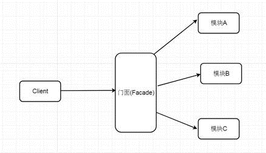

## 定义
	使用一个接口封装复杂的业务逻辑，让客户端使用起来更加简单。
	又称：包装模式，门面模式
## 优缺点
	优点：解耦，简单易用
	缺点：业务封装的增加
## 流程图

## 示例
	@Component
	public class PayFacade {
	
	    @Autowired
	    private LogService logService;
	    @Autowired
	    private MsgService msgService;
	    @Autowired
	    private PaymentService paymentService;
	    @Autowired
	    private ScoreService scoreService;
	
	
	    public void facadeCallback() {
	
	        // 1. 收集支付日志
	        logService.logService();
	        // 2. 修改订单状态
	        paymentService.updatePaymentStatus();
	        // 3. 增加积分
	        scoreService.addScore();
	        // 4. 发送消息
	        msgService.sendMsg();
	
	    }
	}
